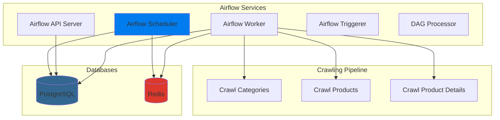

<!-- SEO -->
<!-- Keywords: Tiki Data Pipeline, Airflow, Selenium, Docker, Data Engineering, ETL, Web Scraping, Tiki.vn -->

<div align="center">
  
</div>

<p align="center">
  
  
  
  
</p>

<p align="center">
  
</p>

---

## 📖 Giới thiệu

**Tiki Data Pipeline** là một hệ thống tự động hóa để crawl dữ liệu sản phẩm từ Tiki.vn sử dụng Apache Airflow và Selenium. Dự án cung cấp:

- ✅ Crawl danh mục sản phẩm đệ quy từ Tiki.vn
- ✅ Crawl danh sách sản phẩm từ các danh mục
- ✅ Crawl chi tiết sản phẩm (giá, đánh giá, mô tả, thông số kỹ thuật, hình ảnh, v.v.)
- ✅ Tự động hóa workflow với Airflow DAG
- ✅ Xử lý song song với Dynamic Task Mapping
- ✅ Caching và rate limiting để tối ưu hiệu suất
- ✅ Export dữ liệu dưới dạng JSON

---

## ✨ Tính năng nổi bật

<div align="center">

| 🎯 Feature | 📝 Description |
|:---------:|:-------------|
| 🛍️ **Tiki Product Crawler** | Crawl tự động sản phẩm từ Tiki.vn với Selenium |
| 🔄 **Apache Airflow 3.1.2** | Workflow orchestration với Dynamic Task Mapping |
| 🕷️ **Selenium Automation** | Crawl dynamic content với Selenium WebDriver + Chrome |
| 📊 **Category & Product Details** | Crawl đầy đủ: danh mục, danh sách sản phẩm và chi tiết |
| ⚡ **Optimized Performance** | Caching, rate limiting, batch processing |
| 🔄 **Dynamic Task Mapping** | Crawl song song nhiều categories/products |
| 💾 **Data Export** | JSON output với đầy đủ thông tin sản phẩm |
| 📈 **Sales Count Tracking** | Theo dõi số lượng bán của từng sản phẩm |

</div>

---

## 🛠️ Tech Stack

<p align="center">
  
</p>

<div align="center">
  
| Category | Technologies |
|:--------:|:-----------:|
| **Orchestration** | Apache Airflow 3.1.2, Celery Executor |
| **Web Scraping** | Selenium WebDriver 4.0+, BeautifulSoup4 |
| **Databases** | PostgreSQL 16, Redis 7.2 |
| **Containerization** | Docker, Docker Compose |
| **Languages** | Python 3.8+ |
| **Data Format** | JSON |
| **Tools** | Git, GitHub |

</div>

---

## 🚀 Quick Start

### Prerequisites

```bash
✅ Docker >= 20.10
✅ Docker Compose >= 2.0
✅ RAM: 4GB+ (8GB recommended)
✅ CPU: 2+ cores
✅ Disk: 10GB+ free space
✅ Chrome/Chromium (được cài tự động trong Docker)
```

### Installation

#### 1. Clone Repository

```bash
git clone https://github.com/your-username/tiki-data-pipeline.git
cd tiki-data-pipeline
```

#### 2. Cấu hình môi trường (Optional)

```bash
# Tạo file .env nếu cần (không bắt buộc)
# Các biến môi trường có thể được set trong docker-compose.yaml
```

#### 3. Khởi động Airflow Services

```bash
# Build và khởi động tất cả services
docker-compose up -d --build

# Xem logs
docker-compose logs -f

# Kiểm tra trạng thái
docker-compose ps
```

#### 4. Truy cập Airflow Web UI

- **URL**: http://localhost:8080
- **Username**: `airflow`
- **Password**: `airflow`

#### 5. Chạy Pipeline

**Cách 1: Sử dụng Airflow DAG (Khuyến nghị)**

1. Mở Airflow Web UI: http://localhost:8080
2. Tìm DAG `tiki_crawl_products`
3. Click "Play" để trigger DAG
4. Xem progress trong Graph View

**Cách 2: Chạy script trực tiếp**

```bash
# Crawl categories
python src/pipelines/crawl/crawl_categories_recursive.py

# Crawl products từ categories
python src/pipelines/crawl/crawl_products.py

# Crawl product details (test)
python src/pipelines/crawl/crawl_products_detail.py
```

---

## 📊 Architecture

<div align="center">



</div>

### Services Overview

| Service | Purpose | Port |
|:-------:|:--------|:----:|
| **PostgreSQL** | Airflow metadata database | 5432 (internal) |
| **Redis** | Celery message broker | 6379 (internal) |
| **Airflow API Server** | Web UI và REST API | 8080 |
| **Airflow Scheduler** | Schedule và trigger DAGs | - |
| **Airflow Worker** | Execute tasks | - |
| **Airflow DAG Processor** | Parse và load DAGs | - |
| **Airflow Triggerer** | Handle deferrable tasks | - |

---

## 📁 Project Structure

```
tiki-data-pipeline/
├── 📄 README.md                    # File này
├── 📄 LICENSE                      # MIT License
├── 🐳 docker-compose.yaml          # Docker Compose configuration
├── 📄 requirements.txt             # Python dependencies
├── 📚 docs/                        # Documentation
├── 🔧 scripts/                     # Utility scripts
│   ├── setup/                     # Setup scripts
│   ├── utils/                     # Utility scripts
│   └── shell/                     # Shell scripts
├── ☁️ airflow/                     # Airflow configuration
│   ├── dags/                      # Airflow DAGs
│   │   └── tiki_crawl_products_dag.py
│   ├── logs/                      # Airflow logs
│   ├── config/                    # Airflow config
│   ├── plugins/                   # Airflow plugins
│   ├── setup/                     # Setup scripts
│   │   └── init-airflow-db.sh     # Database init script
│   └── Dockerfile                 # Custom Airflow image với Chrome
├── 💻 src/                         # Source code
│   └── pipelines/
│       └── crawl/                 # Crawling pipelines
│           ├── crawl_categories_recursive.py    # Crawl categories đệ quy
│           ├── crawl_products.py                 # Crawl danh sách sản phẩm
│           ├── crawl_products_detail.py          # Crawl chi tiết sản phẩm
│           ├── extract_category_link_selenium.py # Extract category links
│           ├── build_category_tree.py            # Xây dựng category tree
│           └── config.py                         # Configuration
└── 📊 data/                        # Dữ liệu crawl
    ├── raw/                        # Raw data
    │   ├── categories_recursive_optimized.json   # Danh mục đã crawl
    │   ├── categories_tree.json                  # Category tree
    │   └── products/              # Products data
    │       ├── products.json                      # Danh sách sản phẩm
    │       ├── products_with_detail.json         # Sản phẩm với chi tiết
    │       └── cache/                             # Cache files
    ├── demo/                      # Demo/test data
    └── test_output/              # Test outputs
```

---

## 🔧 Pipeline Workflow

### 1. Crawl Categories

Crawl danh mục sản phẩm đệ quy từ Tiki.vn:

```bash
python src/pipelines/crawl/crawl_categories_recursive.py
```

**Output**: `data/raw/categories_recursive_optimized.json`

**Cấu trúc dữ liệu**:
```json
{
  "name": "Tên danh mục",
  "slug": "ten-danh-muc",
  "url": "https://tiki.vn/...",
  "image_url": "...",
  "parent_url": "...",
  "level": 1
}
```

### 2. Crawl Products

Crawl danh sách sản phẩm từ các danh mục:

```bash
python src/pipelines/crawl/crawl_products.py
```

**Output**: `data/raw/products/products.json`

**Cấu trúc dữ liệu**:
```json
{
  "product_id": "123456789",
  "name": "Tên sản phẩm",
  "url": "https://tiki.vn/...",
  "image_url": "...",
  "sales_count": 2000,
  "category_url": "...",
  "crawled_at": "2024-01-01 12:00:00"
}
```

### 3. Crawl Product Details

Crawl chi tiết sản phẩm (giá, đánh giá, mô tả, thông số kỹ thuật, v.v.):

```bash
python src/pipelines/crawl/crawl_products_detail.py
```

**Output**: `data/raw/products/products_with_detail.json`

**Cấu trúc dữ liệu**:
```json
{
  "product_id": "123456789",
  "name": "Tên sản phẩm",
  "price": {
    "current_price": 100000,
    "original_price": 150000,
    "discount_percent": 33.3,
    "currency": "VND"
  },
  "rating": {
    "average": 4.5,
    "total_reviews": 100
  },
  "description": "...",
  "specifications": {...},
  "images": [...],
  "brand": {...},
  "seller": {...},
  "stock": {...},
  "shipping": {...}
}
```

### 4. Airflow DAG

DAG tự động hóa toàn bộ quy trình:

1. **Load Categories**: Load danh sách categories từ file
2. **Crawl Products**: Crawl products từ categories (Dynamic Task Mapping)
3. **Merge Products**: Merge và lưu danh sách products
4. **Crawl Product Details**: Crawl chi tiết products (Dynamic Task Mapping)
5. **Merge Details**: Merge details vào products
6. **Save Final Data**: Lưu dữ liệu cuối cùng
7. **Validate Data**: Validate dữ liệu đã crawl

**Truy cập**: http://localhost:8080  
**DAG ID**: `tiki_crawl_products`

---

## ⚙️ Configuration

### Airflow Variables

Cấu hình các biến sau trong Airflow UI (Admin → Variables):

| Variable | Default | Description |
|:--------:|:------:|:-----------|
| `TIKI_MAX_CATEGORIES` | `0` | Số danh mục tối đa (0 = tất cả) |
| `TIKI_MAX_PAGES_PER_CATEGORY` | `20` | Số trang tối đa mỗi danh mục |
| `TIKI_MIN_CATEGORY_LEVEL` | `2` | Level danh mục tối thiểu |
| `TIKI_MAX_CATEGORY_LEVEL` | `4` | Level danh mục tối đa |
| `TIKI_USE_SELENIUM` | `false` | Có dùng Selenium cho category crawl |
| `TIKI_CRAWL_TIMEOUT` | `300` | Timeout crawl category (giây) |
| `TIKI_RATE_LIMIT_DELAY` | `1.0` | Delay giữa requests (giây) |
| `TIKI_MAX_PRODUCTS_FOR_DETAIL` | `0` | Số products tối đa crawl detail (0 = tất cả) |
| `TIKI_DETAIL_RATE_LIMIT_DELAY` | `2.0` | Delay cho detail crawl (giây) |
| `TIKI_DETAIL_CRAWL_TIMEOUT` | `60` | Timeout crawl detail (giây) |
| `TIKI_SAVE_BATCH_SIZE` | `10000` | Số sản phẩm mỗi batch khi save |

### Environment Variables

Các biến môi trường có thể được set trong `.env` hoặc `docker-compose.yaml`:

```bash
# Airflow
AIRFLOW_UID=50000
AIRFLOW_PROJ_DIR=.

# Python packages (sẽ được cài tự động)
_PIP_ADDITIONAL_REQUIREMENTS=selenium>=4.0.0 beautifulsoup4>=4.12.0 requests>=2.31.0 lxml>=4.9.0 tqdm>=4.65.0 webdriver-manager>=4.0.0
```

---

## 🎯 Use Cases

<div align="center">

| Use Case | Description | Example |
|:--------:|:-----------|:--------|
| 🛍️ **Product Monitoring** | Theo dõi sản phẩm Tiki | Price tracking, Stock monitoring |
| 📊 **Market Analysis** | Phân tích thị trường | Category trends, Sales analysis |
| 💰 **Price Comparison** | So sánh giá sản phẩm | Competitor analysis |
| 📈 **Data Analytics** | Phân tích dữ liệu sản phẩm | Product performance, Reviews analysis |
| 🔄 **Automated Data Collection** | Thu thập dữ liệu tự động | Daily product updates |

</div>

---

## 🏆 Best Practices

<div align="center">

✅ **Rate Limiting** - Delay giữa các requests để tránh bị block  
✅ **Caching** - Cache dữ liệu đã crawl để tránh crawl lại  
✅ **Error Handling** - Retry mechanism và error logging  
✅ **Resource Management** - Giới hạn tài nguyên cho từng service  
✅ **Data Validation** - Validate dữ liệu trước khi lưu  
✅ **Atomic Writes** - Ghi file an toàn để tránh corruption  

</div>

---

## 📈 Performance & Resources

<div align="center">

| Component | CPU Limit | Memory Limit | Status |
|:---------:|:---------:|:------------:|:------:|
| **PostgreSQL** | 2 cores | 2GB | ✅ Optimized |
| **Redis** | 1 core | 1GB | ✅ Optimized |
| **Airflow Services** | 0.5-2 cores | 256MB-2GB | ✅ Optimized |

**Total Estimated**: ~4-6 CPU cores, ~6-8GB RAM

</div>

---

## ⚠️ Important Notes

<div align="center">

> ⚠️ **Rate Limiting**: Tiki có thể rate limit, sử dụng delay giữa các requests  
> 🔒 **Selenium**: Cần Chrome/Chromium driver để chạy Selenium (được cài tự động trong Docker)  
> 📊 **Data Volume**: Với hàng nghìn sản phẩm, cần đủ disk space  
> 🐳 **Docker**: Đảm bảo đủ tài nguyên hệ thống (RAM, CPU)  
> ⏱️ **Timeout**: Cấu hình timeout phù hợp cho từng task  
> 💾 **Cache**: Sử dụng cache để tránh crawl lại dữ liệu đã có  

</div>

---

## 🐛 Troubleshooting

### Lỗi: ModuleNotFoundError: No module named 'selenium'

**Giải pháp**: Rebuild Docker images để cài packages:

```bash
docker-compose build --no-cache
docker-compose up -d
```

### Lỗi: Chrome/ChromeDriver không tìm thấy

**Giải pháp**: Custom Dockerfile đã cài Chrome tự động. Nếu vẫn lỗi:

```bash
# Rebuild Airflow image
docker-compose build airflow-worker airflow-scheduler
docker-compose up -d
```

### Lỗi: DAG không hiển thị trong Airflow UI

**Giải pháp**: 
1. Kiểm tra DAG file có trong `airflow/dags/`
2. Kiểm tra syntax errors: `docker-compose exec airflow-scheduler airflow dags list`
3. Restart DAG processor: `docker-compose restart airflow-dag-processor`

### Lỗi: Connection timeout khi crawl

**Giải pháp**: 
1. Tăng timeout trong Airflow Variables
2. Kiểm tra network connection
3. Giảm rate limit delay nếu quá chậm

---

## 📚 Documentation

- [Airflow Documentation](https://airflow.apache.org/docs/)
- [Selenium Documentation](https://www.selenium.dev/documentation/)
- [Docker Compose Documentation](https://docs.docker.com/compose/)

---

## 🤝 Contributing

<div align="center">

Chúng tôi hoan nghênh mọi đóng góp! 🎉

[📖 Contributing Guidelines](docs/CONTRIBUTING.md) | [🐛 Report Bug](https://github.com/your-username/tiki-data-pipeline/issues) | [💡 Request Feature](https://github.com/your-username/tiki-data-pipeline/issues)

</div>

---

## 📝 License

<div align="center">

This project is licensed under the **MIT License** - see the [LICENSE](LICENSE) file for details.

[](https://opensource.org/licenses/MIT)

</div>

---

## 🌟 Star History

<div align="center">

[](https://star-history.com/#your-username/tiki-data-pipeline&Date)

</div>

---

<div align="center">
  
  
  <p>Made with ❤️ for the Data Engineering community</p>
  
  <p>
    
    
    
  </p>
</div>
