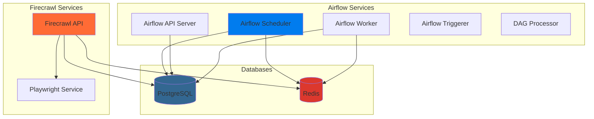

<!-- SEO -->
<!-- Keywords: Data Pipeline, Airflow, Firecrawl, Docker, Data Engineering, ETL, Web Scraping, Self-Hosted -->

<div align="center">
  
</div>

<p align="center">
  
  
  
  
</p>

<p align="center">
  
</p>

---

## ✨ Tính năng nổi bật

<div align="center">

| 🎯 Feature | 📝 Description |
|:---------:|:-------------|
| 🔄 **Apache Airflow 3.1.2** | Workflow orchestration với Celery executor |
| 🕷️ **Firecrawl Self-Host** | Web scraping và crawling engine |
| 🗄️ **Shared Databases** | Tối ưu tài nguyên với 1 Redis + 1 Postgres |
| 🐳 **Docker Compose** | One-command deployment |
| ⚡ **Resource Limits** | Quản lý tài nguyên hiệu quả |
| 🏥 **Health Checks** | Tự động monitoring và recovery |
| 📚 **Full Documentation** | Hướng dẫn chi tiết từ A-Z |
| 🎨 **Template Ready** | Sẵn sàng sử dụng cho dự án mới |

</div>

---

## 🛠️ Tech Stack

<p align="center">
  
</p>

<div align="center">
  
| Category | Technologies |
|:--------:|:-----------:|
| **Orchestration** | Apache Airflow 3.1.2, Celery |
| **Scraping** | Firecrawl, Playwright |
| **Databases** | PostgreSQL 16, Redis 7.2 |
| **Containerization** | Docker, Docker Compose |
| **Languages** | Python, TypeScript, Node.js |
| **Tools** | Git, GitHub Actions |

</div>

---

## 🚀 Quick Start

### Prerequisites

```bash
✅ Docker >= 20.10
✅ Docker Compose >= 2.0
✅ RAM: 4GB+ (8GB recommended)
✅ CPU: 2+ cores
✅ Disk: 10GB+ free space
```

### Installation

<details>
<summary><b>📋 Click để xem hướng dẫn chi tiết</b></summary>

#### 1. Clone Repository

```bash
# Sử dụng như template
gh repo create my-project --template your-username/tiki-data-pipeline

# Hoặc clone trực tiếp
git clone https://github.com/your-username/tiki-data-pipeline.git
cd tiki-data-pipeline
```

#### 2. Cấu hình môi trường

```bash
# Copy file mẫu
cp .env.example .env

# Chỉnh sửa các biến môi trường
nano .env  # hoặc dùng editor khác
```

#### 3. Khởi động services

```bash
# Build và khởi động
docker-compose up -d

# Xem logs
docker-compose logs -f

# Kiểm tra trạng thái
docker-compose ps
```

#### 4. Truy cập services

- **Airflow Web UI**: http://localhost:8080
  - Username: `airflow`
  - Password: `airflow`
  
- **Firecrawl API**: http://localhost:3002
  - Docs: http://localhost:3002/docs

#### 5. Chạy test scripts

```bash
# Test crawling demo
python scripts/tests/test_crawl_demo.py

# Validate hierarchical structure
python scripts/tests/validate_hierarchical.py

# Test API endpoints
python scripts/tests/test_firecrawl_endpoints.py
```

#### 6. Setup scripts

```bash
# Add Groq configuration to .env
python scripts/setup/add_groq_to_env.py

# Fix environment encoding issues
python scripts/setup/fix_env_encoding.py

# Initialize databases
python scripts/setup/init_nuq_db.py
```

#### 7. Utility scripts

```bash
# Verify services status
python scripts/utils/verify_services.py

# Analyze filtering issues
python scripts/utils/analyze_filtering.py

# Check filter issues
python scripts/utils/check_filter_issues.py
```

#### 8. Shell scripts

```bash
# Quick check services (Linux/Mac)
bash scripts/shell/quick-check.sh

# Fix services (Linux/Mac)
bash scripts/shell/fix-services.sh

# Run tests (Windows)
scripts\shell\run_test.bat
```

</details>

---

## 📊 Architecture

<div align="center">



</div>

### Database Architecture

| Service | Database | Purpose |
|:-------:|:--------:|:-------|
| **Airflow** | PostgreSQL `airflow` | Metadata, DAGs, Task states |
| **Airflow** | Redis DB `0` | Celery message broker |
| **Firecrawl** | PostgreSQL `nuq` | NUQ database |
| **Firecrawl** | Redis DB `1` | Queue & rate limiting |

---

## 📁 Project Structure

```
tiki-data-pipeline/
├── 📄 README.md                 # File này
├── 📄 LICENSE                  # MIT License
├── 📄 .env.example             # Environment variables template
├── 🐳 docker-compose.yaml      # Main configuration
├── 📄 requirements.txt         # Python dependencies
├── 📚 docs/                    # Documentation
│   ├── INDEX.md               # Documentation index/navigation
│   ├── README.md              # Documentation overview
│   ├── QUICK_START.md         # Quick start guide
│   ├── TEMPLATE.md            # Template usage
│   ├── SETUP_GITHUB.md        # GitHub setup
│   ├── CONTRIBUTING.md        # Contributing guide
│   ├── FINAL_REPORT.md        # Final project report
│   ├── OPTIMIZATION_SUMMARY.md # Optimization details
│   ├── IMPROVEMENTS.md        # Improvements log
│   ├── DIAGNOSIS.md           # Troubleshooting guide
│   ├── TROUBLESHOOTING.md     # Extended troubleshooting
│   ├── QUICK_FIX.md           # Quick fixes
│   ├── GROQ_CONFIG.md         # Groq configuration guide
│   ├── COMPLETION_SUMMARY.txt  # Completion summary
│   ├── STRUCTURE_GUIDE.txt    # Data structure guide
│   └── CLEANUP_REPORT.md      # Cleanup report
├── 🔧 scripts/                 # Utility scripts (organized by type)
│   ├── tests/                 # Test scripts
│   │   ├── test_*.py          # Test files
│   │   └── validate_*.py     # Validation scripts
│   ├── setup/                 # Setup/init scripts
│   │   ├── setup_*.py         # Setup scripts
│   │   ├── init_*.py          # Initialization scripts
│   │   ├── init-*.sh          # Shell init scripts
│   │   ├── add_groq_to_env.py # Groq env setup
│   │   ├── fix_env_encoding.py # Env encoding fix
│   │   └── nuq_init.sql       # Database init SQL
│   ├── utils/                 # Utility scripts
│   │   ├── analyze_*.py       # Analysis scripts
│   │   ├── check_*.py         # Check scripts
│   │   └── verify_*.py        # Verification scripts
│   └── shell/                 # Shell scripts
│       ├── *.sh               # Shell scripts (Linux/Mac)
│       └── *.bat              # Batch scripts (Windows)
├── ☁️ airflow/                  # Airflow configuration
│   ├── dags/                  # Your DAGs here
│   ├── logs/                  # Airflow logs
│   ├── config/                # Airflow config
│   │   └── airflow.cfg        # Airflow configuration file
│   └── plugins/               # Airflow plugins
├── 🕷️ firecrawl/               # Firecrawl source (reserved)
└── 💻 src/                     # Your source code
    ├── pipelines/             # Data pipelines
    │   └── crawl/            # Crawling pipelines
    │       └── tiki/         # Tiki-specific crawlers
    ├── backend/              # Backend code
    └── utils/                # Utilities
```

---

## 📚 Documentation

<div align="center">

| 📖 Document | 📝 Description | 🔗 Link |
|:----------:|:-------------:|:------:|
| **Quick Start** | Hướng dẫn nhanh để bắt đầu | [📄 docs/QUICK_START.md](docs/QUICK_START.md) |
| **Template Guide** | Cách sử dụng như template | [📄 docs/TEMPLATE.md](docs/TEMPLATE.md) |
| **GitHub Setup** | Setup template repository | [📄 docs/SETUP_GITHUB.md](docs/SETUP_GITHUB.md) |
| **Contributing** | Hướng dẫn contribute | [📄 docs/CONTRIBUTING.md](docs/CONTRIBUTING.md) |
| **Documentation Index** | Mục lục và hướng dẫn điều hướng | [📄 docs/INDEX.md](docs/INDEX.md) |
| **Full Docs** | Tổng quan tài liệu | [📄 docs/README.md](docs/README.md) |

**Tài liệu bổ sung**:
- [📄 Documentation Index](docs/INDEX.md) - Mục lục và hướng dẫn điều hướng
- [📄 Final Report](docs/FINAL_REPORT.md) - Báo cáo tổng kết dự án
- [📄 Troubleshooting Guide](docs/TROUBLESHOOTING.md) - Hướng dẫn xử lý sự cố
- [📄 Optimization Summary](docs/OPTIMIZATION_SUMMARY.md) - Tóm tắt tối ưu hóa
- [📄 Improvements Log](docs/IMPROVEMENTS.md) - Nhật ký cải tiến
- [📄 Diagnosis Guide](docs/DIAGNOSIS.md) - Hướng dẫn chẩn đoán
- [📄 Quick Fix Guide](docs/QUICK_FIX.md) - Hướng dẫn sửa lỗi nhanh
- [📄 Groq Configuration](docs/GROQ_CONFIG.md) - Cấu hình Groq API
- [📄 Structure Guide](docs/STRUCTURE_GUIDE.txt) - Hướng dẫn cấu trúc dữ liệu
- [📄 Cleanup Report](docs/CLEANUP_REPORT.md) - Báo cáo dọn dẹp dự án

</div>

---

## 🎯 Use Cases

<div align="center">

| Use Case | Description | Example |
|:--------:|:-----------|:--------|
| 📊 **ETL Pipelines** | Extract, Transform, Load data | Data warehouse ingestion |
| 🕷️ **Web Scraping** | Automated web data collection | Price monitoring, News aggregation |
| 📈 **Data Processing** | Batch và streaming processing | Analytics, Reporting |
| 🔄 **Workflow Automation** | Complex task orchestration | Multi-step data pipelines |
| 📱 **API Integration** | Connect multiple services | Third-party data sync |

</div>

---

## 🏆 Best Practices

<div align="center">

✅ **Resource Management** - Tất cả services có resource limits  
✅ **Health Monitoring** - Automatic health checks cho tất cả services  
✅ **Security** - Environment variables cho sensitive data  
✅ **Scalability** - Dễ dàng scale từng service độc lập  
✅ **Documentation** - Comprehensive docs cho mọi use case  
✅ **Template Ready** - One-click setup cho dự án mới  

</div>

---

## 📈 Performance & Resources

<div align="center">

| Component | CPU Limit | Memory Limit | Status |
|:---------:|:---------:|:------------:|:------:|
| **PostgreSQL** | 1 core | 1GB | ✅ Optimized |
| **Redis** | 0.5 core | 512MB | ✅ Optimized |
| **Airflow Services** | 0.5-2 cores | 256MB-2GB | ✅ Optimized |
| **Firecrawl Services** | 0.5-2 cores | 512MB-2GB | ✅ Optimized |

**Total Estimated**: ~4-6 CPU cores, ~6-8GB RAM

</div>

---

## 🔧 Scripts Organization

### Test Scripts (`scripts/tests/`)

```bash
# Test crawling demo
python scripts/tests/test_crawl_demo.py

# Validate hierarchical structure
python scripts/tests/validate_hierarchical.py

# Test API endpoints
python scripts/tests/test_firecrawl_endpoints.py

# Test products extraction
python scripts/tests/test_extract_products_logic.py
```

### Setup Scripts (`scripts/setup/`)

```bash
# Add Groq configuration to .env
python scripts/setup/add_groq_to_env.py

# Fix environment encoding issues
python scripts/setup/fix_env_encoding.py

# Initialize NUQ database
python scripts/setup/init_nuq_db.py

# Setup Groq Firecrawl
python scripts/setup/setup_groq_firecrawl.py

# Setup Tiki pool
python scripts/setup/setup_tiki_pool.py
```

### Utility Scripts (`scripts/utils/`)

```bash
# Verify services status
python scripts/utils/verify_services.py

# Analyze filtering issues
python scripts/utils/analyze_filtering.py

# Check filter issues
python scripts/utils/check_filter_issues.py
```

### Shell Scripts (`scripts/shell/`)

```bash
# Quick check services (Linux/Mac)
bash scripts/shell/quick-check.sh

# Fix services (Linux/Mac)
bash scripts/shell/fix-services.sh

# Setup new project (Linux/Mac)
bash scripts/shell/setup-new-project.sh

# Run tests (Windows)
scripts\shell\run_test.bat
```

---

## 🤝 Contributing

<div align="center">

Chúng tôi hoan nghênh mọi đóng góp! 🎉

[📖 Contributing Guidelines](docs/CONTRIBUTING.md) | [🐛 Report Bug](https://github.com/your-username/tiki-data-pipeline/issues) | [💡 Request Feature](https://github.com/your-username/tiki-data-pipeline/issues)

</div>

---

## 📊 Project Stats

<div align="center">

<p align="center">
  
  
</p>

<p align="center">
  
</p>

</div>

---

## 🔗 Links & Resources

<div align="center">

| Resource | Link |
|:--------:|:----|
| **Apache Airflow** | [Documentation](https://airflow.apache.org/docs/) |
| **Firecrawl** | [Self-Host Guide](https://docs.firecrawl.dev/self-hosting) |
| **Docker Compose** | [Documentation](https://docs.docker.com/compose/) |
| **Issues** | [GitHub Issues](https://github.com/your-username/tiki-data-pipeline/issues) |
| **Discussions** | [GitHub Discussions](https://github.com/your-username/tiki-data-pipeline/discussions) |

</div>

---

## ⚠️ Important Notes

<div align="center">

> ⚠️ **Security**: File `.env` chứa thông tin nhạy cảm, **KHÔNG** commit lên Git  
> 🔒 **Production**: Thay đổi mật khẩu mặc định và sử dụng secrets management  
> 📊 **Scaling**: Cân nhắc tách riêng databases nếu cần isolation cao  
> 🐳 **Docker**: Đảm bảo đủ tài nguyên hệ thống trước khi chạy  

</div>

---

## 📝 License

<div align="center">

This project is licensed under the **MIT License** - see the [LICENSE](LICENSE) file for details.

[](https://opensource.org/licenses/MIT)

</div>

---

## 🌟 Star History

<div align="center">

[](https://star-history.com/#your-username/tiki-data-pipeline&Date)

</div>

---

<div align="center">
  
  
  <p>Made with ❤️ for the Data Engineering community</p>
  
  <p>
    
    
    
  </p>
</div>

