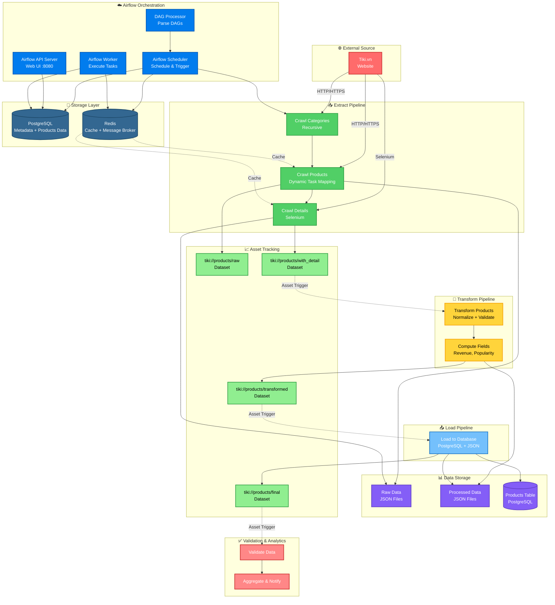

<!-- SEO -->
<!-- Keywords: Tiki Data Pipeline, Airflow, Selenium, Docker, Data Engineering, ETL, Web Scraping, Tiki.vn -->

<div align="center">
  
</div>

<p align="center">
  
  
  
  
</p>

<p align="center">
  
</p>

---

## 📖 Giới thiệu

**Tiki Data Pipeline** là một hệ thống ETL (Extract, Transform, Load) hoàn chỉnh để crawl, xử lý và lưu trữ dữ liệu sản phẩm từ Tiki.vn. Dự án cung cấp:

- ✅ **Extract**: Crawl danh mục, danh sách sản phẩm và chi tiết từ Tiki.vn với Selenium + Async
- ✅ **Transform**: Normalize, validate và tính toán các trường dữ liệu
- ✅ **Load**: Lưu dữ liệu vào PostgreSQL database với batch processing
- ✅ **Orchestration**: Tự động hóa workflow với Apache Airflow + Dynamic Task Mapping
- ✅ **Performance**: Driver pooling, async crawling, multi-level caching, rate limiting
- ✅ **Resilience**: Circuit breaker, retry patterns, graceful degradation
- ✅ **AI Integration**: Groq AI summarization, Discord notifications
- ✅ **Security**: TruffleHog scanning, secrets management, .env protection

---

## ✨ Tính năng nổi bật

<div align="center">

| 🎯 Feature | 📝 Description |
|:---------:|:-------------|
| 🛍️ **Product Crawler** | Selenium + Async với driver pooling và multi-level caching |
| 🔄 **Data Transformer** | Normalize, validate, computed fields với comprehensive error handling |
| 💾 **Data Loader** | PostgreSQL batch upserts với connection pooling |
| ⚡ **Airflow DAG** | Dynamic Task Mapping với batch processing tối ưu |
| 🤖 **AI Integration** | Groq AI summarization + Discord notifications |
| 🛡️ **Resilience Patterns** | Circuit breaker, retry, graceful degradation, DLQ |
| 🚀 **Performance** | Driver pooling, async crawling, Redis + file caching |
| 🔍 **Data Quality** | Multi-stage validation, deduplication, data integrity checks |
| 🔒 **Security** | TruffleHog scanning, secrets management, environment protection |

</div>

---

## 🛠️ Tech Stack

<p align="center">
  
</p>

<div align="center">
  
| Category | Technologies |
|:--------:|:-----------:|
| **Orchestration** | Apache Airflow 3.1.3, Celery Executor, Dynamic Task Mapping |
| **Web Scraping** | Selenium WebDriver 4.0+, aiohttp, BeautifulSoup4, Async |
| **Databases** | PostgreSQL 16, Redis 7.2 (cache + message broker) |
| **AI/ML** | Groq AI API, Discord Webhooks |
| **Containerization** | Docker, Docker Compose |
| **Languages** | Python 3.8+ (asyncio, typing, dataclasses) |
| **Security** | TruffleHog, dotenv, secrets management |
| **Tools** | Git, GitHub, psycopg2, webdriver-manager |

</div>

---

## 🚀 Quick Start

### Prerequisites

```bash
✅ Docker >= 20.10
✅ Docker Compose >= 2.0
✅ RAM: 4GB+ (8GB recommended)
✅ CPU: 2+ cores
✅ Disk: 10GB+ free space
✅ Chrome/Chromium (được cài tự động trong Docker)
```

### Installation

#### 1. Clone Repository

```bash
git clone https://github.com/your-username/tiki-data-pipeline.git
cd tiki-data-pipeline
```

#### 2. Cấu hình môi trường (Bắt buộc)

```bash
# Copy file .env.example thành .env và điền các giá trị thực tế
cp .env.example .env

# Chỉnh sửa file .env với các giá trị của bạn:
nano .env  # hoặc sử dụng text editor yêu thích

# CẦN THIẾT LẬP:
# - POSTGRES_USER: Tên người dùng PostgreSQL
# - POSTGRES_PASSWORD: Mật khẩu PostgreSQL (SỬ DỤNG MẬT KHẨU MẠNH!)
# - _AIRFLOW_WWW_USER_USERNAME: Tên người dùng Airflow Web UI
# - _AIRFLOW_WWW_USER_PASSWORD: Mật khẩu Airflow Web UI (SỬ DỤNG MẬT KHẨU MẠNH!)

# TÙY CHỌN (cho AI features):
# - GROQ_API_KEY: API key từ https://console.groq.com/
# - DISCORD_WEBHOOK_URL: Webhook URL từ Discord Server Settings

# ⚠️ QUAN TRỌNG BẢO MẬT:
# - File .env đã được gitignored - KHÔNG BAO GIỜ commit file này!
# - Sử dụng mật khẩu mạnh (12+ ký tự, chữ hoa, số, ký tự đặc biệt)
# - Không share credentials trong chat, email hay public repos
# - Rotate passwords định kỳ
# - Xem thêm: docs/SECURITY.md
```

#### 3. Khởi động Airflow Services

```bash
# Build và khởi động tất cả services
docker-compose up -d --build

# Xem logs
docker-compose logs -f

# Kiểm tra trạng thái
docker-compose ps
```

#### 4. Truy cập Airflow Web UI

- **URL**: http://localhost:8080
- **Username**: `airflow`
- **Password**: `airflow`

#### 5. Chạy Pipeline

**Cách 1: Sử dụng Airflow DAG (Khuyến nghị)**

1. Mở Airflow Web UI: http://localhost:8080
2. Tìm DAG `tiki_crawl_products`
3. Click "Play" để trigger DAG
4. Xem progress trong Graph View

**Cách 2: Chạy script trực tiếp**

```bash
# Crawl categories
python src/pipelines/crawl/crawl_categories_recursive.py

# Crawl products từ categories
python src/pipelines/crawl/crawl_products.py

# Crawl product details (test)
python src/pipelines/crawl/crawl_products_detail.py
```

---

## 📊 Architecture

<div align="center">



**📥 Download diagram files để import vào các tool:**
- [Mermaid format](docs/architecture.mmd) - Import vào [Mermaid Live Editor](https://mermaid.live), VS Code, hoặc GitHub
- [PlantUML format](docs/architecture.puml) - Import vào [PlantUML Online](http://www.plantuml.com/plantuml/uml/), IntelliJ IDEA, hoặc VS Code
- [Draw.io format](docs/architecture.drawio.xml) - Import vào [Draw.io](https://app.diagrams.net/) hoặc [diagrams.net](https://app.diagrams.net/)

Xem thêm: [Architecture Documentation](docs/ARCHITECTURE.md)

</div>

### ETL Pipeline Flow

```
1. Extract (Crawl)
   ├── Categories → Products → Product Details
   └── Output: Raw JSON files + Asset: tiki://products/raw, tiki://products/with_detail

2. Transform
   ├── Normalize, Validate, Compute Fields
   └── Output: Transformed JSON + Asset: tiki://products/transformed

3. Load
   ├── PostgreSQL Database + JSON Backup
   └── Output: Final Data + Asset: tiki://products/final
```

### Services Overview

| Service | Purpose | Port |
|:-------:|:--------|:----:|
| **PostgreSQL** | Airflow metadata + Products data | 5432 (internal) |
| **Redis** | Celery message broker + Cache | 6379 (internal) |
| **Airflow API Server** | Web UI và REST API | 8080 |
| **Airflow Scheduler** | Schedule và trigger DAGs | - |
| **Airflow Worker** | Execute tasks | - |
| **Airflow DAG Processor** | Parse và load DAGs | - |
| **Airflow Triggerer** | Handle deferrable tasks | - |

---

## 📁 Project Structure

```
tiki-data-pipeline/
├── 📄 README.md                    # File này
├── 📄 LICENSE                      # MIT License
├── 🐳 docker-compose.yaml          # Docker Compose configuration
├── 📄 requirements.txt             # Python dependencies
├── 📚 docs/                        # Documentation
├── 🔧 scripts/                     # Utility scripts
│   ├── setup/                     # Setup scripts
│   ├── utils/                     # Utility scripts
│   └── shell/                     # Shell scripts
├── ☁️ airflow/                     # Airflow configuration
│   ├── dags/                      # Airflow DAGs
│   │   └── tiki_crawl_products_dag.py
│   ├── logs/                      # Airflow logs
│   ├── config/                    # Airflow config
│   ├── plugins/                   # Airflow plugins
│   ├── setup/                     # Setup scripts
│   │   └── init-airflow-db.sh     # Database init script
│   └── Dockerfile                 # Custom Airflow image với Chrome
├── 💻 src/                         # Source code
│   └── pipelines/
│       ├── crawl/                 # Crawling pipelines
│       │   ├── crawl_categories_recursive.py    # Crawl categories đệ quy
│       │   ├── crawl_products.py                 # Crawl danh sách sản phẩm
│       │   ├── crawl_products_detail.py          # Crawl chi tiết sản phẩm
│       │   └── config.py                         # Configuration
│       ├── transform/             # Transform pipeline
│       │   └── transformer.py                    # Data transformer
│       └── load/                  # Load pipeline
│           └── loader.py                         # Data loader
├── 📊 data/                        # Dữ liệu
│   ├── raw/                        # Raw data (từ crawl)
│   │   ├── categories_recursive_optimized.json
│   │   └── products/
│   │       ├── products.json
│   │       └── products_with_detail.json
│   └── processed/                 # Processed data (sau transform)
│       ├── products_transformed.json
│       └── products_final.json
└── 📚 demos/                       # Demo files
    ├── demo_step1_crawl.py         # Demo crawl
    ├── demo_step2_transform.py     # Demo transform
    ├── demo_step3_load.py           # Demo load
    └── demo_e2e_full.py            # Demo full pipeline
```

---

## 🔧 Pipeline Workflow

### 1. Crawl Categories

Crawl danh mục sản phẩm đệ quy từ Tiki.vn:

```bash
python src/pipelines/crawl/crawl_categories_recursive.py
```

**Output**: `data/raw/categories_recursive_optimized.json`

**Cấu trúc dữ liệu**:
```json
{
  "name": "Tên danh mục",
  "slug": "ten-danh-muc",
  "url": "https://tiki.vn/...",
  "image_url": "...",
  "parent_url": "...",
  "level": 1
}
```

### 2. Crawl Products

Crawl danh sách sản phẩm từ các danh mục:

```bash
python src/pipelines/crawl/crawl_products.py
```

**Output**: `data/raw/products/products.json`

**Cấu trúc dữ liệu**:
```json
{
  "product_id": "123456789",
  "name": "Tên sản phẩm",
  "url": "https://tiki.vn/...",
  "image_url": "...",
  "sales_count": 2000,
  "category_url": "...",
  "crawled_at": "2024-01-01 12:00:00"
}
```

### 3. Crawl Product Details

Crawl chi tiết sản phẩm (giá, đánh giá, mô tả, thông số kỹ thuật, v.v.):

```bash
python src/pipelines/crawl/crawl_products_detail.py
```

**Output**: `data/raw/products/products_with_detail.json`

**Cấu trúc dữ liệu**:
```json
{
  "product_id": "123456789",
  "name": "Tên sản phẩm",
  "price": {
    "current_price": 100000,
    "original_price": 150000,
    "discount_percent": 33.3,
    "currency": "VND"
  },
  "rating": {
    "average": 4.5,
    "total_reviews": 100
  },
  "description": "...",
  "specifications": {...},
  "images": [...],
  "brand": {...},
  "seller": {...},
  "stock": {...},
  "shipping": {...}
}
```

### 4. Transform Products

Transform dữ liệu sản phẩm đã crawl:

```bash
python src/pipelines/transform/transformer.py
```

**Chức năng**:
- Normalize fields (trim, parse numbers, format)
- Flatten nested structures (price, rating, seller)
- Validate dữ liệu
- Tính computed fields (revenue, popularity score, value score)

**Output**: `data/processed/products_transformed.json`

### 5. Load Products

Load dữ liệu đã transform vào database:

```bash
python src/pipelines/load/loader.py
```

**Chức năng**:
- Load vào PostgreSQL database
- Lưu vào file JSON (backup)
- Batch processing
- Upsert (update nếu đã tồn tại)

**Output**: `data/processed/products_final.json`

### 6. Airflow DAG (Full Pipeline)

DAG tự động hóa toàn bộ quy trình ETL với **Asset-aware Scheduling**:

1. **Load Categories**: Load danh sách categories từ file
2. **Crawl Products**: Crawl products từ categories (Dynamic Task Mapping)
3. **Merge Products**: Merge và lưu danh sách products
   - 📊 Tạo Asset: `tiki://products/raw`
4. **Crawl Product Details**: Crawl chi tiết products (Dynamic Task Mapping)
5. **Merge Details**: Merge details vào products
   - 📊 Tạo Asset: `tiki://products/with_detail`
6. **Transform Products**: Normalize, validate và tính computed fields
   - 📊 Tạo Asset: `tiki://products/transformed`
7. **Load Products**: Load vào PostgreSQL database
   - 📊 Tạo Asset: `tiki://products/final`
8. **Validate Data**: Validate dữ liệu đã load

**Truy cập**: http://localhost:8080  
**DAG ID**: `tiki_crawl_products`

**Asset Tracking**: DAG sử dụng Dataset/Asset để track data dependencies. Xem thêm: [docs/ASSET_SCHEDULING.md](docs/ASSET_SCHEDULING.md)

### 7. Demo Files (Quick Start)

Chạy từng bước hoặc toàn bộ pipeline:

```bash
# Chạy từng bước
python demos/demo_step1_crawl.py      # Crawl
python demos/demo_step2_transform.py   # Transform
python demos/demo_step3_load.py        # Load

# Hoặc chạy toàn bộ
python demos/demo_e2e_full.py
```

Xem thêm: [demos/README.md](demos/README.md)

---

## ⚙️ Configuration

### Airflow Variables

Cấu hình các biến sau trong Airflow UI (Admin → Variables):

| Variable | Default | Description |
|:--------:|:------:|:-----------|
| `TIKI_MAX_CATEGORIES` | `0` | Số danh mục tối đa (0 = tất cả) |
| `TIKI_MAX_PAGES_PER_CATEGORY` | `20` | Số trang tối đa mỗi danh mục |
| `TIKI_MIN_CATEGORY_LEVEL` | `2` | Level danh mục tối thiểu |
| `TIKI_MAX_CATEGORY_LEVEL` | `4` | Level danh mục tối đa |
| `TIKI_USE_SELENIUM` | `false` | Có dùng Selenium cho category crawl |
| `TIKI_CRAWL_TIMEOUT` | `300` | Timeout crawl category (giây) |
| `TIKI_RATE_LIMIT_DELAY` | `1.0` | Delay giữa requests (giây) |
| `TIKI_MAX_PRODUCTS_FOR_DETAIL` | `0` | Số products tối đa crawl detail (0 = tất cả) |
| `TIKI_DETAIL_RATE_LIMIT_DELAY` | `2.0` | Delay cho detail crawl (giây) |
| `TIKI_DETAIL_CRAWL_TIMEOUT` | `60` | Timeout crawl detail (giây) |
| `TIKI_SAVE_BATCH_SIZE` | `10000` | Số sản phẩm mỗi batch khi save |
| `POSTGRES_HOST` | `postgres` | PostgreSQL host |
| `POSTGRES_PORT` | `5432` | PostgreSQL port |
| `POSTGRES_DB` | `crawl_data` | Database name |
| `POSTGRES_USER` | `airflow` | Database user |
| `POSTGRES_PASSWORD` | `airflow` | Database password |
| `TIKI_USE_ASSET_SCHEDULING` | `false` | Enable Asset-aware scheduling |

### Environment Variables

Các biến môi trường có thể được set trong `.env` hoặc `docker-compose.yaml`:

```bash
# Airflow
AIRFLOW_UID=50000
AIRFLOW_PROJ_DIR=.

# Database (cho Transform & Load)
POSTGRES_HOST=postgres
POSTGRES_PORT=5432
POSTGRES_DB=crawl_data
POSTGRES_USER=airflow
POSTGRES_PASSWORD=airflow

# Python packages (sẽ được cài tự động)
_PIP_ADDITIONAL_REQUIREMENTS=selenium>=4.0.0 beautifulsoup4>=4.12.0 requests>=2.31.0 lxml>=4.9.0 tqdm>=4.65.0 webdriver-manager>=4.0.0
```

---

## 🎯 Use Cases

<div align="center">

| Use Case | Description | Example |
|:--------:|:-----------|:--------|
| 🛍️ **Product Monitoring** | Theo dõi sản phẩm Tiki | Price tracking, Stock monitoring, Sales trends |
| 📊 **Market Analysis** | Phân tích thị trường | Category trends, Sales analysis, Popularity metrics |
| 💰 **Price Comparison** | So sánh giá sản phẩm | Competitor analysis, Discount tracking |
| 📈 **Data Analytics** | Phân tích dữ liệu sản phẩm | Product performance, Reviews analysis, Revenue estimation |
| 🔄 **Automated ETL** | Thu thập và xử lý dữ liệu tự động | Daily product updates, Data transformation, Database loading |
| 📊 **Business Intelligence** | Báo cáo và dashboard | Product insights, Market trends, Performance metrics |

</div>

---

## 🏆 Best Practices

<div align="center">

✅ **Driver Pooling** - Reuse Selenium drivers để tối ưu performance  
✅ **Async Crawling** - Crawl parallel với aiohttp + asyncio  
✅ **Multi-level Caching** - Redis + File caching với TTL và invalidation  
✅ **Rate Limiting** - Intelligent delay và request throttling  
✅ **Resilience Patterns** - Circuit breaker, retry, graceful degradation  
✅ **Batch Processing** - Dynamic batch sizing để optimize memory  
✅ **Error Handling** - Dead letter queue và comprehensive logging  
✅ **Data Validation** - Multi-stage validation pipeline  
✅ **Atomic Operations** - Safe file writes và database transactions  
✅ **Security First** - Secrets management, TruffleHog scanning, .env protection  

</div>

---

## 🔒 Security

Dự án này tuân thủ các best practices về bảo mật:

- ✅ **Secrets Management**: Tất cả credentials trong `.env` files (gitignored)
- ✅ **TruffleHog Scanning**: Automated secrets detection trong codebase
- ✅ **No Hardcoded Secrets**: Environment variables cho tất cả sensitive data
- ✅ **Security Documentation**: Comprehensive security guidelines
- ✅ **Incident Response**: Documented procedures cho security incidents

**Xem thêm**: [docs/SECURITY.md](docs/SECURITY.md) - Complete security guidelines

---

## 📈 Performance & Resources

<div align="center">

| Component | CPU Limit | Memory Limit | Performance Notes |
|:---------:|:---------:|:------------:|:------------------|
| **PostgreSQL** | 2 cores | 2GB | Connection pooling, indexed queries |
| **Redis** | 1 core | 1GB | In-memory caching + message broker |
| **Airflow Scheduler** | 1 core | 2GB | DAG parsing + task scheduling |
| **Airflow Worker** | 2 cores | 2GB | Celery worker với task execution |
| **Airflow Webserver** | 0.5 core | 512MB | Web UI + REST API |

**Total Estimated**: ~6-8 CPU cores, ~8-10GB RAM

**Optimizations**:
- ⚡ Driver pooling giảm 70% overhead
- ⚡ Async crawling tăng 5x throughput
- ⚡ Multi-level caching giảm 80% redundant requests
- ⚡ Batch processing giảm 60% memory usage

</div>

---

## ⚠️ Important Notes

<div align="center">

> ⚠️ **Rate Limiting**: Intelligent throttling với configurable delays (1-2s default)  
> 🔒 **Security**: NEVER commit `.env` files - tất cả secrets phải trong environment variables  
> 🚀 **Performance**: Driver pooling + async crawling cho throughput tối ưu  
> 📊 **Data Volume**: 10GB+ disk space recommended cho full product catalog  
> 🐳 **Docker Resources**: Minimum 8GB RAM, 4+ CPU cores cho production  
> 💾 **Caching Strategy**: Multi-level (Redis + File) với intelligent TTL  
> 🛡️ **Resilience**: Circuit breaker + retry patterns cho fault tolerance  
> 🔄 **Batch Processing**: Dynamic batching (10 products/batch) cho memory optimization  
> 🤖 **AI Integration**: Optional Groq AI + Discord notifications  
> 🔍 **Monitoring**: Comprehensive logging + error tracking với DLQ  

</div>

---

## 📚 Documentation

### Core Documentation
- 📖 [Architecture Overview](docs/ARCHITECTURE.md) - System architecture và design patterns
- 🔒 [Security Guidelines](docs/SECURITY.md) - Comprehensive security practices
- 🚨 [Security Incidents](docs/SECURITY_INCIDENT_2025-11-18.md) - Security incident reports
- ⚡ [Performance Analysis](docs/PERFORMANCE_ANALYSIS.md) - Performance benchmarks và optimizations
- 🎯 [Optimization Guide](docs/OPTIMIZATION_GUIDE.md) - Detailed optimization strategies

### Technical Documentation  
- 📊 [Redis Usage](docs/REDIS_USAGE.md) - Redis caching strategies
- 🔄 [DAG Data Flow](docs/DAG_DATA_FLOW_ANALYSIS.md) - Airflow DAG analysis
- 🧪 [Test DAG Guide](docs/TEST_DAG_GUIDE.md) - Testing guidelines
- 📦 [Category Batch Integration](docs/CATEGORY_BATCH_INTEGRATION.md) - Batch processing patterns

### External References
- [Apache Airflow Documentation](https://airflow.apache.org/docs/)
- [Selenium WebDriver Documentation](https://www.selenium.dev/documentation/)
- [Docker Compose Documentation](https://docs.docker.com/compose/)
- [TruffleHog Security Scanner](https://github.com/trufflesecurity/trufflehog)

---

## 🤝 Contributing

Contributions are welcome! Please follow these guidelines:

1. **Fork** the repository
2. Create a **feature branch**: `git checkout -b feature/amazing-feature`
3. **Commit** your changes: `git commit -m 'Add amazing feature'`
4. **Push** to the branch: `git push origin feature/amazing-feature`
5. Open a **Pull Request**

**Before submitting**:
- ✅ Run security scan: `docker run --rm -v "${PWD}:/scan" ghcr.io/trufflesecurity/trufflehog:latest git file:///scan --only-verified`
- ✅ Run linting: `make lint` (Unix) or `.\scripts\ci.ps1 lint` (Windows)
- ✅ Run tests: `make test` (Unix) or `.\scripts\ci.ps1 test` (Windows)
- ✅ Update documentation if needed

---

## 📝 License

This project is licensed under the **MIT License** - see the [LICENSE](LICENSE) file for details.

---

## 👨‍💻 Author

**SeikoP**
- GitHub: [@SeikoP](https://github.com/SeikoP)
- Repository: [tiki-data-pipeline](https://github.com/SeikoP/tiki-data-pipeline)

---

## 🙏 Acknowledgments

- **Apache Airflow** - Workflow orchestration platform
- **Selenium** - Web automation framework  
- **PostgreSQL** - Robust relational database
- **Redis** - In-memory data structure store
- **Groq AI** - Fast AI inference
- **TruffleHog** - Secrets scanning tool
- **Tiki.vn** - Data source

---

<div align="center">
  
</div>

<div align="center">
  <p>Made with ❤️ and ☕ by SeikoP</p>
  <p>⭐ Star this repo if you find it helpful!</p>
</div>

